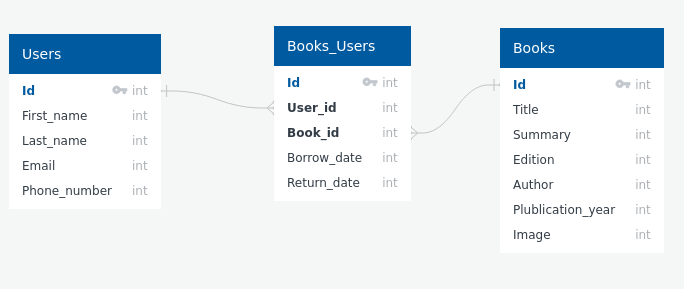

# BIBLIOSF

## Cahier des charges

A l'aide de **Symfony** vous devez réaliser un site web qui listes des livres d'une bibliotheque nommée **BIBLIOS**F.

- Le schema de la base de donnée se trouve dans le dossier **data** 

- Créer une gestion des **utilisateurs** : **connexion,déconnexion,enregistrement**

- Créer des **cruds** pour les **utilisateurs** et les **livres**
- Ajouter des fausses données via des **fixtures** et **faker**

- Dans votre **navbar** il doit y avoir 
    - Le nom de la bibliotheque **BIBLIOSF** à l'extreme gauche
    - A l'extreme droite : 3 boutons/liens : **connexion,déconnexion,enregistrement** , les boutons **connexion et enregistrement** doivent disparaitres quand on est **connecté**

- La **page d'acceuil** doit afficher les livres sous forme de **cards** avec le **titre** et l'**image** 
- Pour les **images** mettez des **urls** de livres existants
- Lorsque on **click** sur un **livre** on visualise sa fiche complete : **titre,resume,edition,auteur,année de publication,image**

- Libre à vous d'utiliser un **framework css**
- Faite un **readme** expliquant la démarche pour installer et lancer votre site web

## Git

- Récupérer tous les fichiers de ce dépôt afin **d'en créer un** sur votre compte **github** , le rendre **privé** m'envoyer une invitation pour je puisse y avoir accès
- Votre travail se fera dans une branche nommée **developp** (c'est cette **branche** qui sera pris en compte pour la review de code)
- Abuser des **branches** pour votre travail
- Vous devrez faire des commits fréquents (atomiques) , soigner les libelles de vos **commits**

## Barème de notation

- **Git** /2
- **Base de donnée** /3
- **Frontend HTML/CSS/TWIG** /4
- **Backend SYMFONY/PHP** /10
- **Clean Code** /1

Si vous avez la moindre question créer une **issue** sur ce dépot , bon code.
